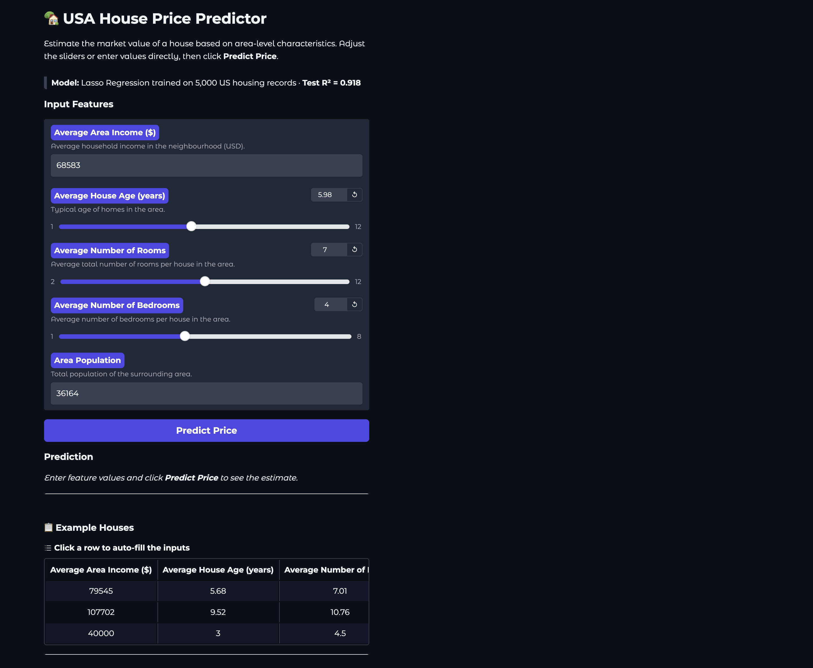
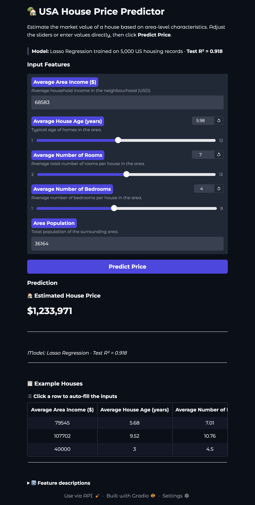

# House Price Prediction & Deployment

## Overview
This project predicts house prices using the USA Housing dataset and deploys the best-performing regression model as an interactive Gradio web application. The workflow includes exploratory data analysis (EDA), model training/comparison, best-model selection, and deployment.

## Dataset
- Source: USA Housing dataset (`data/USA_Housing.csv`)
- Features used:
	- Avg. Area Income
	- Avg. Area House Age
	- Avg. Area Number of Rooms
	- Avg. Area Number of Bedrooms
	- Area Population
- Target: Price
- Total samples: 5,000
- Train/Test split: 4,000 / 1,000

## Model Comparison
All trained models from `notebooks/2_training.ipynb` are shown below.

| Model | Train R2 | Test R2 | Test MSE |
| --- | ---: | ---: | ---: |
| Lasso Regression | 0.917979 | 0.917998 | 10,088,940,217.89 |
| Ridge Regression | 0.917979 | 0.917997 | 10,089,003,188.71 |
| Linear Regression | 0.917979 | 0.917997 | 10,089,009,300.89 |
| Polynomial Regression (Degree 1) | 0.917979 | 0.917997 | 10,089,009,300.89 |
| KNN Regression (K=9) | 0.901118 | 0.875551 | 15,311,227,371.92 |

## Final Model
- Model name: Lasso Regression
- Test R2: 0.917998 (approximately 0.918)
- Test MSE: 10,088,940,217.89

Why this model was chosen:
- It achieved the best test R2 among all trained models.
- It had the lowest test MSE in the comparison table.
- Train and test R2 are almost identical, indicating strong generalization and no obvious overfitting.
- EDA showed mostly linear relationships with price, which aligns well with linear regularized models such as Lasso.

## Web Application
The project is deployed with Gradio using `app.py`.

### Screenshots



## Installation
```bash
git clone https://github.com/nahiyan762/house-price-prediction
cd house-price-prediction
pip install -r requirements.txt
```

## How To Run The Project
1. Start the Gradio web app:

```bash
python app.py
```

2. Open the local URL printed in the terminal (typically `http://127.0.0.1:7860`).

3. Enter feature values and click **Predict Price**.

## Project Structure
```text
house-price-prediction/
|-- data/
|   `-- USA_Housing.csv
|-- models/
|   `-- best_model.pkl
|-- notebooks/
|   |-- 1_eda.ipynb
|   `-- 2_training.ipynb
|-- screenshots/
|   |-- gradio_interface.png
|   `-- gradio_prediction.png
|-- app.py
|-- requirements.txt
`-- README.md
```

## Technologies Used
- Python
- Pandas, NumPy, Matplotlib, Seaborn
- scikit-learn
- Gradio
